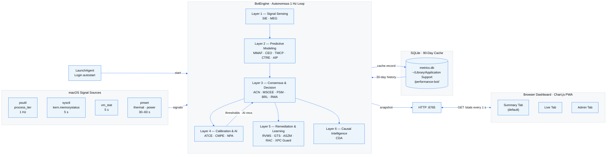
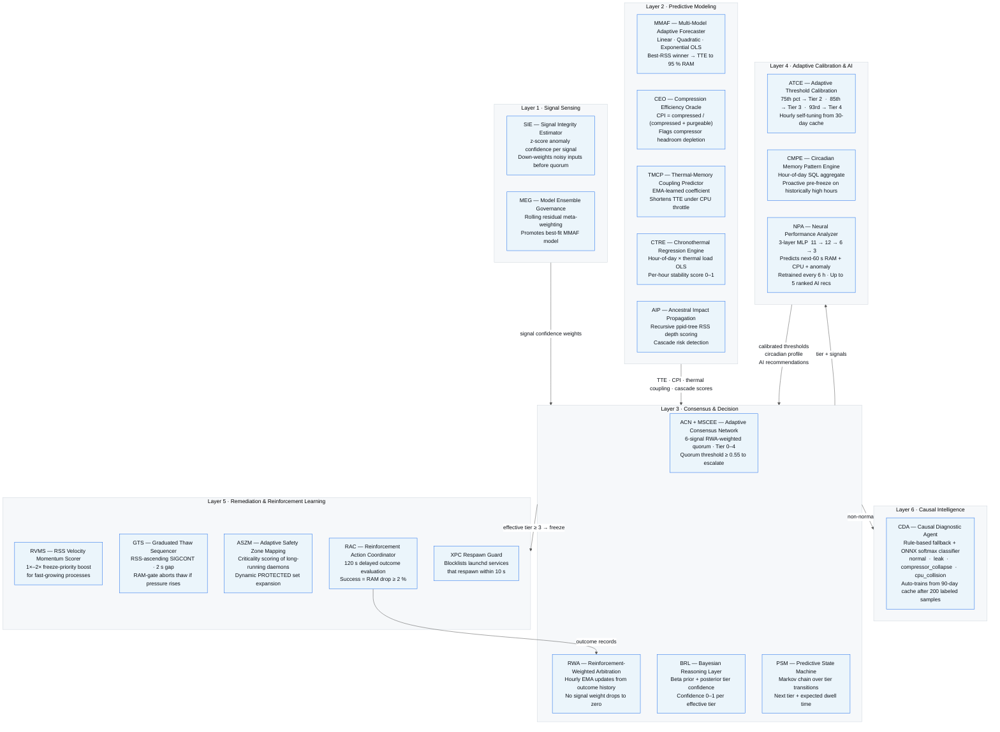

# MAC Performance Bot

A lightweight, always-on macOS performance monitor with **autonomous closed-loop resource management**, a **21-engine 6-layer control architecture**, a **4-tab installable PWA dashboard**, and an **optional offline on-device LLM** for plain-English crash explanations, summaries, and Q&A.

Current version: **2.6.1**

---

## Architecture Overview



---

## 6-Layer Engine Detail



---

## How It Works

The bot runs a single `psutil.process_iter()` scan every second and layers autonomous intelligence on top.

### Poll Schedule

| Interval | Method | What happens |
|----------|--------|--------------|
| 1 s | `_collect()` | Metrics + CPU throttle detection + swap velocity + RAC outcome check |
| 3 s | `_check_memory()` | MSCEE 6-signal quorum → effective tier → remediation cascade |
| 5 s | `_update_pressure_and_forecast()` | `sysctl` + `vm_stat` + MMAF/MEG forecast + CEO CPI + TMCP TTE + AIP ancestry |
| 10 s | `_check_disk()` | Disk usage cached — no per-request reads |
| 30 s | `_check_power_mode()` | Battery vs AC |
| 30 s | `_detect_xpc_respawn()` | XPC Respawn Guard scan |
| 30 s | `_sweep_idle_services()` | Tier-4 idle XPC termination window |
| 60 s | `_check_thermal()` | `pmset` thermal throttle |
| 60 s | `_check_crash_reports()` | Surfaces new macOS crash/exception reports (`~/Library/Logs/DiagnosticReports/*.ips`) into the Activity Log |
| 60 s | `_track_memory_leaks()` | Per-process RSS growth rate |
| 60 s | `_check_circadian_pressure()` | CMPE hour-of-day profile + proactive pre-freeze |
| 60 s | `_run_npa()` | NPA inference — next-60 s RAM/CPU + anomaly + 5 AI recommendations |
| 60 s | `cache.flush()` | SQLite batch write (`executemany`) |
| 300 s | `_check_caches()` | `~/Library/Caches` size warning |
| 3600 s | Self-tuning engines | ATCE thresholds · TMCP coupling · RWA weights · CTRE stability · ASZM zones · BRL priors |
| 30 days | `_cda_train_model()` | CDA ONNX softmax retrain (needs ≥ 200 labeled samples) |

### Remediation Tiers

| Tier | Label | RAM trigger | TTE trigger | Action |
|------|-------|-------------|-------------|--------|
| 0 | All Good | < 80 % | — | Monitor only |
| 1 | Watching | ≥ 80 % | — | Log issue + top RSS consumer report |
| 2 | Intervening | ≥ 82 % | TTE ≤ 10 min | Purgeable advisory + wired warning + genealogy report |
| 3 | Rescue Mode | ≥ 87 % | TTE ≤ 5 min | RVMS-scored SIGSTOP of background daemons; GTS thaw on recovery |
| 4 | Emergency | ≥ 92 % | TTE ≤ 2 min | SIGTERM of idle XPC / widget services (XPC Guard enforced) |

> MSCEE adopts a candidate tier only when the weighted quorum vote reaches **≥ 0.55**.
> Thresholds self-tune hourly via ATCE from 30-day cache percentiles.

---

## Dashboard — 4-Tab Layout

### Summary Tab *(default)*

The user-facing home view. No jargon — plain-English status at a glance.

| Element | Description |
|---------|-------------|
| Health Score | 0–100 daily score derived from `100 − (0.5×avg_mem + 0.3×avg_cpu + 0.2×avg_swap)` over 24 h |
| Active Tier | Human-readable tier label (All Good / Watching / Intervening / Rescue Mode / Emergency) |
| Root Cause Banner | Prominent plain-English alert from CDA (hidden when `normal`) |
| Quick-stat cards | RAM · CPU · Swap · Disk with current % and colour coding |
| AI Recommendations | Up to 5 ranked NPA cards (critical → warning → info → tip → all-clear) |
| Bot Activity Today | Interventions · Success Rate · RAM Freed · Memory Paused |
| Top Consumers | Top RSS processes with LEAK badge and 💡 Restart hint |

### Live Tab

Real-time operational monitoring.

| Element | Description |
|---------|-------------|
| Metric strip | SVG ring gauges — CPU / Memory / Swap / Disk |
| Achievement banner | Crises Averted · Total RAM Saved · Time Below 87 % · Biggest Single Save |
| CPU + Swap sparklines | 90-second Chart.js canvas with warning threshold line |
| Memory Intelligence arc | Large arc gauge + % + GB + MMAF forecast ETA |
| Memory Composition | `vm_stat` segmented bar — wired / active / inactive / compressed / free / purgeable |
| Bot Status | Throttled / Actions / Issues / Memory Paused counts |
| Activity Log | Live FIX / WARN / ISSUE / INFO event feed with filter bar + keyword search |
| Process Table | Top-12 processes — CPU/MEM bars · THROTTLED/LEAK badges · context menu (Freeze / Thaw / Terminate) |

### Admin Tab

Expert diagnostics and historical data.

| Element | Description |
|---------|-------------|
| System vmrows | Total RAM · Swap Used · Disk Free · Uptime |
| Engine State vmrows | Active Tier · CPU-RAM Lock · XPC Blocked · Frozen Daemons · Leak Alerts |
| Forecast vmrows | Forecast Model · CPI · Swap Velocity · Thermal Coupling · Cache size |
| Intelligence vmrows | Root Cause · BRL Confidence · ACN Weights · Signal Integrity · PSM Next Tier · CTRE Zone · Action Efficacy · ASZM Protected+ |
| 7-Day History chart | Multi-line RAM / CPU / Swap trend with hourly aggregates from SQLite |
| Expert / Simple toggle | Shows or hides intelligence vmrows (persisted in `localStorage`) |
| Bot Logs toggle | Shows or hides internal engine calibration events in the activity feed |

### Insights Tab *(optional — requires `pip install mlx-lm`)*

Offline, on-device LLM features — nothing here ever leaves this Mac, and the tab shows a
one-line install hint instead of erroring if `mlx-lm` isn't installed.

| Element | Description |
|---------|-------------|
| Ask | Free-form question box, grounded in recent hourly telemetry + today's digest + recent crash explanations |
| Summary | Daily / weekly narrative digest, generated automatically (cooldown-gated) or on-demand via Regenerate |
| Recent Crash Explanations | Plain-English explanations, triggered by clicking "Explain" on a crash entry in the Activity Log (Live tab) |

---

## Features

- **Neural AI recommendations** — NPA (3-layer MLP, no external dependencies) trains every 6 h on 30-day cache history; predicts next-60 s RAM, CPU, and anomaly score; generates up to 5 prioritised plain-English cards
- **Autonomous closed-loop control** — detects pressure → predicts escalation → remediates → evaluates outcome → adjusts weights, all without user input
- **Adaptive signal weights** — RWA/ACN reinforcement learning adjusts the 6-signal quorum weights hourly from remediation outcomes
- **Root-cause diagnosis** — CDA classifies system state as normal / leak / compressor_collapse / cpu_collision
- **Bayesian tier confidence** — BRL maintains a Beta posterior over tier-activation frequencies
- **Markov next-tier prediction** — PSM predicts the next effective tier and expected dwell time
- **Chronothermal regression** — CTRE maps hour-of-day × thermal load to memory stability zones
- **Ancestral impact propagation** — AIP scores process families by cascading RSS depth
- **Dynamic protected set** — ASZM elevates long-running, low-CPU system daemons automatically
- **Reinforcement action coordinator** — RAC measures post-action RAM deltas at 120 s; confirmed rescues increment `crises_averted`
- **Value-add achievement panel** — Crises Averted / GB Saved / % time below 87 % / biggest save backed by SQLite aggregate
- **Signal integrity validation** — SIE z-score anomaly detection down-weights noisy signals in ACN
- **Model ensemble governance** — MEG promotes the historically best-fit MMAF model via rolling residual tracking
- **4-tier remediation cascade** — observe → advisory → SIGSTOP idle daemons → emergency termination
- **MSCEE 6-signal quorum** — RAM %, TTE, kernel oracle, CPI, swap velocity, circadian; ≥ 0.55 weighted vote required
- **Graduated Thaw Sequencing (GTS)** — RSS-ascending SIGCONT with 2 s gap and RAM-gate abort
- **RSS Velocity Momentum Scoring (RVMS)** — 1×–2× freeze-priority boost for fast-growing processes
- **MMAF 3-model forecaster** — linear OLS / quadratic / exponential; best-RSS winner per tick drives TTE
- **Compression Efficiency Oracle (CEO)** — CPI signal flags compressor headroom depletion before RAM saturates
- **Adaptive threshold calibration (ATCE)** — hourly self-tuning of Tier 2/3/4 from 30-day cache percentiles
- **Circadian pre-freeze (CMPE)** — proactive daemon freeze during historically high-pressure hours
- **Thermal-memory coupling (TMCP)** — EMA-learned coefficient shortens TTE under CPU throttle
- **CPU-RAM Conflict Resolution Gate** — blocks CPU priority restoration for top RAM owners under active pressure
- **XPC Respawn Guard** — blocklists launchd services that respawn within 10 s
- **Crash Report Monitor** — surfaces real macOS crash/exception reports into the Activity Log, the same class of "error" Activity Monitor / Console.app shows; reads only the lightweight report header, never the full stack trace
- **Activity-Monitor-accurate CPU visibility** — top-process table unions top-by-memory with top-by-CPU so a single-core spike is never hidden behind a memory-only sort; the "High CPU" warning uses raw per-core CPU (matching `ps`/Activity Monitor's 100%-per-core convention) instead of a system-wide-normalized value
- **90-day disk cache** — SQLite; batch-flushed every 60 s; pruned daily; powers all engine learning loops
- **Offline LLM Insights (optional)** — on-device MLX language model (`mlx-community/Qwen2.5-3B-Instruct-4bit`, ~2GB, no data ever leaves the Mac) powers plain-English crash-report explanations, daily/weekly narrative summaries, and a free-form Ask panel; lazy-loaded and idle-unloaded so it costs zero RAM when not in use, and generation runs on a background job queue so the dashboard never freezes waiting on it
- **Zero heavy dependencies** — only `psutil` + Python stdlib; optional `onnx` / `onnxruntime` for CDA ONNX export, optional `mlx-lm` for LLM Insights
- **Lightweight by design** — single `psutil.process_iter()` per second; all syscalls cached; O(1) event ring-buffer

---

## Quick Start

```bash
git clone https://github.com/itsmeSugunakar/MAC_Perf_BOT.git
cd MAC_Perf_BOT
bash scripts/install_gui.sh
open http://127.0.0.1:8765
```

Install as a standalone app: open `http://127.0.0.1:8765` in Chrome or Safari → **Add to Dock / Install app**.

---

## Project Structure

```
MAC_Perf_BOT/
├── CLAUDE.md                            # CMDB — architecture, thresholds, full API reference
├── README.md                            # This file
├── app/
│   ├── performance_gui.py               # Dashboard + full 6-layer engine stack  ← main entry point
│   └── performance_bot.py               # Headless CLI bot (no browser)
├── config/
│   ├── com.user.performancebot-gui.plist    # LaunchAgent: GUI + HTTP server
│   └── com.user.performancebot.plist        # LaunchAgent: headless bot
├── scripts/
│   ├── install_gui.sh                   # Install + start GUI app
│   ├── install.sh                       # Install + start headless bot
│   └── uninstall.sh                     # Remove all LaunchAgents + stop processes
├── docs/
│   ├── architecture.md                  # Full 6-layer diagram + data-flow + engine schedule
│   ├── design-diagram.mmd               # Standalone Mermaid source
│   ├── design-diagram.png               # Rendered architecture PNG (2800×2000 px)
│   ├── whitepaper.md                    # Technical whitepaper
│   └── provisional-patent-application.md   # USPTO PPA technical spec
└── logs/                                # Runtime logs (git-ignored)
```

---

## Requirements

| Component | Requirement |
|-----------|-------------|
| macOS | 13 Ventura or later (Apple Silicon & Intel) |
| Python | 3.11+ via Homebrew (`/opt/homebrew/bin/python3.11`) |
| psutil | ≥ 5.9 — auto-installed by install script |
| onnx + onnxruntime | ≥ 1.14 / ≥ 1.16 — **optional**; enables CDA ONNX model export after 200 training samples |
| mlx-lm | **optional**, Apple Silicon only; enables the Insights tab (crash explanations, digests, Ask panel) — `pip install mlx-lm`, first use downloads a ~2GB model |
| rumps | **optional**; enables macOS Menu Bar icon |
| Browser | Chrome / Safari / Firefox — for the PWA dashboard |

---

## Manual Usage

```bash
# Start the dashboard (opens browser automatically)
/opt/homebrew/bin/python3.11 app/performance_gui.py

# Stop autostart agent
launchctl unload ~/Library/LaunchAgents/com.user.performancebot-gui.plist

# Restart to pick up code changes
launchctl stop  com.user.performancebot-gui
launchctl start com.user.performancebot-gui

# Remove everything
bash scripts/uninstall.sh
```

---

## Disk Cache

| Property | Value |
|----------|-------|
| Location | `~/Library/Application Support/performance-bot/metrics.db` |
| Format | SQLite (Python `sqlite3` stdlib — no extra dependency), WAL journal mode |
| Core schema | `ts, cpu_pct, mem_pct, swap_pct, disk_pct, pressure, eff_tier, tte_min, thermal_pct` |
| v2.0 tables | `remediation_outcomes` (RAC outcome log) · `signal_weights` (RWA weight history) |
| Write cadence | Batch `executemany()` every 60 s |
| Retention | 90 days — pruned automatically once per day |
| Max size | ~35–45 MB at 90 days (1 row per 10 s = ~8 640 rows/day) |
| Read pattern | Aggregate SQL only (`AVG`, `COUNT`, `GROUP BY`) — no raw rows loaded into Python |

---

## Security

- HTTP server binds to **loopback only** (`127.0.0.1:8765`) — never accessible from the network
- Only `nice()`, `SIGSTOP`, `SIGCONT`, and `SIGTERM` are used — no process can be deleted or corrupted
- `PROTECTED` set blocks touching kernel, WindowServer, Finder, Dock, coreaudiod, and the bot itself
- `_no_kill` blocklist prevents looping SIGTERM on launchd-managed services
- Disk cache contains only numeric metric values — no process names, file paths, or user-identifiable data

---

## License

Itzzdata
