# Architecture — MAC Performance Bot

## Design Diagram (Mermaid)

> Standalone diagram files: [`design-diagram.mmd`](design-diagram.mmd) · [`design-diagram.png`](design-diagram.png)

```mermaid
%%{init: {"theme": "base", "themeVariables": {"primaryColor": "#E8F4FD", "primaryTextColor": "#0D1117", "primaryBorderColor": "#1F6FEB", "lineColor": "#1F6FEB", "secondaryColor": "#FFF8E7", "tertiaryColor": "#F0FFF4", "clusterBkg": "#FAFBFC", "clusterBorder": "#D0D7DE", "edgeLabelBackground": "#FFFFFF", "fontFamily": "Segoe UI, Arial, sans-serif", "fontSize": "13px"}}}%%
flowchart TB

    %% ═══════════════════════════════════════════════
    %% EXTERNAL: Inputs
    %% ═══════════════════════════════════════════════
    subgraph SRC ["macOS System  ·  Signal Sources"]
        direction LR
        PS["psutil\nprocess_iter()\n1 Hz"]
        SYS["sysctl\nkern.memorystatus\n5 s"]
        VM["vm_stat\nVM anatomy\n5 s"]
        PM["pmset\nthermal + power\n30–60 s"]
    end

    LA["LaunchAgent\nLogin autostart\nKeepAlive · ThrottleInterval 30 s"]

    %% ═══════════════════════════════════════════════
    %% PROCESSING CORE — BotEngine
    %% ═══════════════════════════════════════════════
    subgraph ENGINE ["BotEngine  ·  Autonomous 1 Hz Processing Loop  ·  performance_gui.py"]
        direction TB

        subgraph L1 ["Layer 1  ·  Signal Sensing"]
            direction LR
            SIE["SIE\nSignal Integrity Estimator\nz-score confidence per signal"]
            MEG["MEG\nModel Ensemble Governance\nResidual meta-weighting (MMAF)"]
        end

        subgraph L2 ["Layer 2  ·  Predictive Modeling"]
            direction LR
            MMAF["MMAF\nMulti-Model Adaptive Forecaster\nLinear · Quadratic · Exponential\nBest-RSS model → TTE to 95 %"]
            CEO["CEO\nCompression Efficiency Oracle\nCPI = compressed / (compressed + purgeable)"]
            TMCP["TMCP\nThermal-Memory Coupling Predictor\nEMA-learned TTE shortening under throttle"]
            CTRE["CTRE\nChronothermal Regression Engine\nHour-of-day × thermal OLS stability score"]
            AIP["AIP\nAncestral Impact Propagation\nRecursive ppid-tree RSS depth scoring"]
        end

        subgraph L3 ["Layer 3  ·  Consensus  &  Decision"]
            direction LR
            ACN["ACN + MSCEE\nAdaptive Consensus Network\n6-signal RWA-weighted quorum\nEffective Tier 0 – 4  ·  Quorum ≥ 0.55"]
            BRL["BRL\nBayesian Reasoning Layer\nBeta prior + posterior\nTier confidence 0 – 1"]
            PSM["PSM\nPredictive State Machine\nMarkov chain over tier transitions\nNext tier + dwell prediction"]
            RWA["RWA\nReinforcement-Weighted Arbitration\nHourly EMA weight updates\nfrom remediation outcomes"]
        end

        subgraph L4 ["Layer 4  ·  Adaptive Calibration  &  AI"]
            direction LR
            ATCE["ATCE\nAdaptive Threshold Calibration Engine\n75th → T2  ·  85th → T3  ·  93rd → T4\nHourly self-tuning from 30-day cache"]
            CMPE["CMPE\nCircadian Memory Pattern Engine\nHour-of-day SQL aggregate\nProactive pre-freeze on peak hours"]
            NPA["NPA\nNeural Performance Analyzer\n3-layer MLP  11→12→6→3\nNext-60 s RAM + CPU + anomaly score\nRetrained every 6 h · Up to 5 AI recs"]
        end

        subgraph L5 ["Layer 5  ·  Remediation  &  Reinforcement Learning"]
            direction LR
            RVMS["RVMS\nRSS Velocity Momentum Scorer\nVelocity boost 1 × – 2 × on freeze score"]
            GTS["GTS\nGraduated Thaw Sequencer\nRSS-ascending SIGCONT\n2 s gap  ·  RAM-gate abort"]
            ASZM["ASZM\nAdaptive Safety Zone Mapping\nCriticality scoring\nDynamic PROTECTED set"]
            RAC["RAC\nReinforcement Action Coordinator\n120 s delayed outcome evaluation\nSuccess = RAM drop ≥ 2 %"]
            XG["XPC Respawn Guard\nNo-kill blocklist\nlaunchd-managed services"]
        end

        subgraph L6 ["Layer 6  ·  Causal Intelligence"]
            direction LR
            CDA["CDA\nCausal Diagnostic Agent\nRule-based + ONNX softmax classifier\nnormal  ·  leak  ·  compressor_collapse  ·  cpu_collision\nAuto-trains from 90-day cache (200+ samples)"]
        end

    end

    %% ═══════════════════════════════════════════════
    %% STORAGE — SQLite 90-Day Cache
    %% ═══════════════════════════════════════════════
    subgraph STORE ["Persistent Storage  ·  SQLite  ·  ~/Library/Application Support/performance-bot/metrics.db"]
        direction LR
        DM[("metrics\n1 row / 10 s  ·  90-day rolling\n~8 640 rows/day  ·  35–45 MB max")]
        DRO[("remediation_outcomes\nper-action tier · pre/post RAM\nsuccess/failure classification")]
        DSW[("signal_weights\nACN weight snapshot history")]
    end

    %% ═══════════════════════════════════════════════
    %% SERVICE — HTTP on loopback
    %% ═══════════════════════════════════════════════
    subgraph SVC ["HTTP Service  ·  127.0.0.1:8765  ·  Loopback only"]
        HTTP["HTTP Handler\nGET /              → HTML PWA\nGET /stats         → JSON snapshot  (< 12 KB)\nGET /history       → 7-day hourly aggregates\nGET /pause?state=  → engine control\nGET /manifest.json → PWA manifest"]
    end

    %% ═══════════════════════════════════════════════
    %% CLIENT — Browser Dashboard
    %% ═══════════════════════════════════════════════
    subgraph DASH ["Browser Dashboard  ·  Chart.js PWA  ·  Poll /stats every 1 s"]
        direction LR
        TAB1["Summary Tab  (default)\nHealth Score 0–100  ·  Active Tier\nRoot Cause banner  ·  AI Recommendations\nQuick-stat cards  ·  Top consumers"]
        TAB2["Live Tab\nCPU + Swap 90 s sparklines\nMemory arc + composition\nProcess table + Activity log"]
        TAB3["Admin Tab\nEngine vmrows (Simple / Expert)\nSystem · Engine State · Forecast\nIntelligence · 7-Day History"]
    end

    MB["macOS Menu Bar\nTier icon + RAM %\nOptional — requires rumps\nUpdates every 3 s via engine state"]

    %% ═══════════════════════════════════════════════
    %% EDGES — Inputs → Engine
    %% ═══════════════════════════════════════════════
    LA              -->|"start + keepalive restart"| ENGINE
    PS              -->|"CPU · RAM · top procs · swap velocity"| ENGINE
    SYS             -->|"kernel pressure oracle"| ENGINE
    VM              -->|"wired · active · inactive · compressed · free"| ENGINE
    PM              -->|"thermal throttle % · battery vs AC"| ENGINE

    %% ═══════════════════════════════════════════════
    %% EDGES — Layer flows (within Engine)
    %% ═══════════════════════════════════════════════
    L1              -->|"signal confidence per metric"| L3
    L2              -->|"TTE · CPI · thermal coupling · cascade risk"| L3
    L3              -->|"effective tier + calibrated weights"| L5
    L3              -->|"tier + raw signals"| L4
    L3              -->|"causal trigger"| L6
    L4              -->|"calibrated thresholds\ncircadian profile\nNPA recommendations"| L3

    %% ═══════════════════════════════════════════════
    %% EDGES — Storage reads / writes
    %% ═══════════════════════════════════════════════
    ENGINE          -->|"cache.record() every 10 s\ncache.flush() every 60 s"| DM
    DM              -->|"30-day percentiles → ATCE\nhour-of-day avgs → CMPE\nMMEG residuals → MEG\nthermal rows → TMCP\nhour × thermal → CTRE\n30-day strides → NPA training\ntier frequency → BRL\nuptime rows → ASZM"| L4
    DM              -->|"tier distribution → BRL"| L3
    RAC             -->|"outcome record (tier · pre/post RAM · success)"| DRO
    DRO             -->|"accuracy history per action"| RWA
    DSW             <-->|"persist / restore"| RWA

    %% ═══════════════════════════════════════════════
    %% EDGES — Service
    %% ═══════════════════════════════════════════════
    ENGINE          -->|"snapshot() on every request"| HTTP
    HTTP            -->|"JSON snapshot + 7-day history"| DASH
    DASH            -->|"GET /stats every 1 s"| HTTP
    MB              -->|"reads engine state every 3 s"| ENGINE
```



## Data Flow

```
macOS kernel  (sysctl, vm_stat, pmset)
      │
      ▼  psutil + subprocess
BotEngine (background thread, 1 Hz)
      │
      ├── cpu_hist[], mem_hist[], swap_hist[]   ← in-RAM ring buffer (90 s)
      ├── top_procs[]                           ← sorted by CPU, top-12
      ├── throttled{}                           ← pid → name map
      ├── events[]                              ← deque(maxlen=200), O(1)
      │
      ├── MMIE / Engine state (v1.5)
      │   ├── mem_pressure_level                ← kernel sysctl oracle
      │   ├── vm_breakdown{}                    ← vm_stat anatomy
      │   ├── mem_forecast_min                  ← MMAF TTE (minutes)
      │   ├── _last_forecast_model              ← MEG winner: "linear"|"quadratic"|"exponential"
      │   ├── _compression_pressure             ← CEO CPI (0.0–1.0)
      │   ├── _swap_velocity                    ← MB/s swap growth rate
      │   ├── _thermal_coupling                 ← TMCP EMA coefficient
      │   ├── _circadian_profile{}              ← CMPE hour→avg RAM %
      │   ├── _cal_thresholds{}                 ← ATCE live tier thresholds
      │   ├── mem_ancestry[]                    ← ppid-tree RSS families
      │   ├── effective_tier                    ← MSCEE/ACN output (0–4)
      │   ├── predictive_escalation             ← TTE drove tier up
      │   ├── _ram_pressure_lock                ← CPU-RAM conflict gate
      │   ├── _frozen_pids{}                    ← SIGSTOP'd daemons
      │   └── _no_kill                          ← XPC respawn blocklist
      │
      ├── v2.0 Engine state
      │   ├── _signal_confidence{}              ← SIE: {cpu, mem, swap} ∈ [0.5, 1.0]
      │   ├── _sie_history{}                    ← SIE: rolling 30-sample deques per signal
      │   ├── _model_residual_history{}         ← MEG: 5-sample residual deques per MMAF model
      │   ├── _acn_weights{}                    ← ACN/RWA: adaptive {s1..s6} weights (sum=1)
      │   ├── _brl_confidence                   ← BRL: posterior tier confidence (0.0–1.0)
      │   ├── _brl_tier_prior[]                 ← BRL: Beta alpha counts per tier [0..4]
      │   ├── _psm_next_tier                    ← PSM: Markov-predicted next effective_tier
      │   ├── _psm_dwell_s                      ← PSM: predicted dwell time in next tier (s)
      │   ├── _tier_transitions                 ← PSM: deque(maxlen=20) of (from, to, ts)
      │   ├── _transition_matrix{}              ← PSM: {(from,to): count} for Markov weights
      │   ├── _ctre_stability{}                 ← CTRE: {hour: stability_score 0.0–1.0}
      │   ├── _aip_impact[]                     ← AIP: top-8 [{app, impact_score, cascade_depth, child_mb}]
      │   ├── _pending_outcomes[]               ← RAC: [(eval_ts, tier, action, pre_mem)]
      │   ├── _action_efficacy{}                ← RAC/RWA: action_type → avg RAM-drop %
      │   ├── _dynamic_protected                ← ASZM: set(PROTECTED) + elevated daemons
      │   ├── _criticality_scores{}             ← ASZM: process name → criticality float
      │   └── causal_diagnosis                  ← CDA: "normal"|"leak"|"compressor_collapse"|"cpu_collision"
      │
      ├── v2.1 Product metrics
      │   ├── performance_score (int)            ← 0–100 daily score; -1 = warming up (<10 min data)
      │   │                                         formula: 100 − (0.5×avg_mem + 0.3×avg_cpu + 0.2×avg_swap)
      │   │                                         refreshed every 5 min from MetricsCache
      │   ├── longterm_avg_mem (float)           ← 30-day average RAM %; pre-loaded from DB at startup;
      │   │                                         drives upgrade recommendation
      │   └── _leak_pids (set[int])              ← PIDs currently flagged as memory leaks;
      │                                             kept in sync with _warned_leaks by _track_memory_leaks()
      │
      ├── v2.2 Value-add metrics
      │   ├── freed_mb (float)                   ← MB reclaimed by actual process termination only
      │   ├── suspended_mb (float)               ← MB of SIGSTOP'd processes (RSS held, not freed)
      │   ├── crises_averted (int)               ← session count: RAC-confirmed rescues (tier ≥ 2,
      │   │                                         delta_pct ≥ 2 %) incremented in _evaluate_rac_outcomes()
      │   └── value_add (dict)                   ← interventions_today() snapshot: today + all-time
      │                                             remediation_outcomes aggregates
      │
      └── MetricsCache (disk)
          └── ~/Library/Application Support/performance-bot/metrics.db
              ← 90-day SQLite store, flushed every 60 s
              ← pruned daily (DELETE WHERE ts < now - 90 days)
               │
               ├── app_mem_trend()              → week-over-week RAM trends
               ├── chronic_pressure_pct()       → % time above MEM_WARN
               ├── daily_performance_score()    → 0–100 score from last 24 h  [v2.1]
               ├── longterm_avg_mem(30d)        → 30-day avg RAM %             [v2.1]
               ├── hourly_history(7d)           → [{hour, mem, cpu, swap}] for /history [v2.1]
               ├── _analyse_app_predictions()   → risk ratings per app
               ├── _calibrate_thresholds()      → ATCE percentile query (30d)
               ├── _build_circadian_profile()   → CMPE GROUP BY hour (all rows)
               └── _compute_thermal_coupling()  → TMCP regression (throttled rows)
                    │
               snapshot() also exposes: frozen_count (int), leak_pids (int),
                    performance_score (int), longterm_avg_mem (float), leak_pids_list (list[int])
                    ▼ snapshot() called by HTTP handler
      HTTP Handler (main thread)
            │
            ├── GET /             → HTML page (embedded, ~35 KB)
            ├── GET /stats        → JSON snapshot (< 12 KB)
            ├── GET /history      → 7-day hourly JSON [{hour,mem,cpu,swap}]  [v2.1]
            ├── GET /manifest.json → PWA manifest
            ├── GET /icon.svg     → PWA icon
            └── GET /pause?state= → toggle engine.running
                  │
                  ▼  polling every 1 s via setInterval
      Browser (Chart.js PWA)
            ├── Tab bar           — Live | 7-Day History tabs              [v2.1]
            ├── Performance Score — 0–100 headline metric in tab bar         [v2.1]
            ├── Metric strip      — ring gauges: CPU / MEM / Swap / Disk
            │   + Achievement banner: Crises Averted / Total RAM Saved / Time <87% / Biggest Save  [v2.2]
            ├── Root Cause Banner — prominent plain-English alert when non-normal [v2.1]
            ├── RAM Recommendation — "add RAM" advisory when 30d avg > 80%   [v2.1]
            ├── Memory Intelligence panel — arc gauge, vm_stat breakdown,
            │   Active Tier (user language: All Good/Watching/Intervening/Rescue Mode/Emergency),
            │   predictive escalation banner, CPU-RAM Lock, XPC Blocked,
            │   Forecast Model, CPI, Swap Velocity, Thermal Coupling,
            │   App Predictions panel, Root Cause (CDA), BRL Confidence,
            │   ACN Weights sparkbar, Signal Integrity traffic-light,
            │   PSM Next Tier, CTRE Zone stability, Action Efficacy, ASZM Protected+
            │   (expert rows hidden by default; Simple/Expert toggle in titlebar)
            ├── 7-Day History tab — Chart.js multi-line RAM/CPU/Swap trend    [v2.1]
            ├── CPU / Swap sparklines (90 s canvas charts)
            ├── Bot Status cards  — Throttled / Actions / Issues / Memory Paused [v2.1]
            ├── Activity log      — FIX / WARN / ISSUE / INFO events
            │   (Bot Logs toggle hides engine calibration events by default)   [v2.1]
            └── Process table     — top-12 with CPU/MEM bars, LEAK badge,
                  💡 Restart? hint for leak-flagged processes, memory trend    [v2.1]

      macOS Menu Bar (optional — requires `pip install rumps`)               [v2.1]
            ├── Shows current tier icon (🟢🔵🟡🟠🔴) + RAM % in menu bar
            ├── Submenu: Status / RAM / Bot actions / Open Dashboard / Quit
            └── Updates every 3 s from engine state; daemon thread, no blocking
```

---

## Thread Model

```
Main thread      → HTTPServer.serve_forever()
bot-engine       → BotEngine.run()  (daemon=True)
timer thread     → webbrowser.open() after 0.8 s  (one-shot)
menubar thread   → _start_menubar() via rumps  (daemon=True, optional)  [v2.1]
```

All shared state is protected by `BotEngine._lock` (threading.Lock).
The HTTP handler reads only via `snapshot()` — never writes — so lock contention
is minimal and brief.
`MetricsCache` runs all SQLite I/O on the `bot-engine` thread — no additional threads.

### Cached values (avoid repeated syscalls)

| Field                            | Set by                 | Read by                             | Syscall saved                |
| -------------------------------- | ---------------------- | ----------------------------------- | ---------------------------- |
| `self._ncpu`                     | `__init__` (once)      | `_collect`, `_restore_calmed_procs` | `cpu_count()` per tick       |
| `self._last_vm`                  | `_collect` (1 Hz)      | `_check_memory` (0.33 Hz)           | `virtual_memory()` every 3 s |
| `self._last_swap`                | `_collect` (1 Hz)      | `_check_memory` (0.33 Hz)           | `swap_memory()` every 3 s    |
| `self.disk_pct` / `disk_free_gb` | `_check_disk` (0.1 Hz) | `snapshot()` / HTTP handler         | `disk_usage()` per request   |
| `self._last_disk_pct`            | `_check_disk` (0.1 Hz) | `_collect` cache record             | `disk_usage()` per second    |
| `self._last_forecast_model`      | `_compute_mem_forecast()` (0.2 Hz) | `snapshot()`            | recomputation every tick     |
| `self._compression_pressure`     | `_update_pressure_and_forecast()` (0.2 Hz) | `snapshot()`, MSCEE | CEO per 5 s only        |
| `self._thermal_coupling`         | `_compute_thermal_coupling()` (hourly) | `_adjust_tte_for_thermal()` | DB regression once/h |

---

## Engine Tick Schedule

```
Every 1 s   → _collect()
               ONE psutil.process_iter() scan — collects metrics AND detects
               CPU hogs inline using p.info[] (cached attrs, no extra syscalls).
               Stores _last_vm / _last_swap for downstream methods.
               Computes _swap_velocity (MB/s) from delta vs _last_swap_used.
               Records 1 cache row every 10 s (time % 10 gate, no disk I/O otherwise).
               Cache row includes thermal_pct column (9-column INSERT).

               _restore_calmed_procs() — restores nice(0) only for processes in
               self.throttled (typically 0–3 items); no process scan.

Every 3 s   → _check_memory()
               Reads _last_vm (no syscall). Calls _compute_effective_tier()
               via MSCEE 6-signal quorum, then _tiered_memory_remediation().

Every 5 s   → _update_pressure_and_forecast()
               Spawns sysctl + vm_stat subprocesses. Updates mem_pressure_level,
               vm_breakdown, mem_ancestry.
               Calls _compute_mem_forecast() [MMAF: 3-model ensemble, best-RSS winner].
               Calls _compute_compression_pressure() [CEO: CPI = compressed/(compressed+purgeable)].
               Calls _adjust_tte_for_thermal() [TMCP: shorten TTE under thermal throttle].

Every 10 s  → _check_disk()
               Single psutil.disk_usage("/") call; stores disk_pct / disk_free_gb
               for snapshot(). No per-request disk reads in Handler.
               Emits ISSUE at ≥ 90 % used; WARN at ≥ 80 % used.

Every 30 s  → _check_power_mode()   (pmset -g ps subprocess)
Every 30 s  → _detect_xpc_respawn() (process name set scan)
Every 30 s  → _sweep_idle_services() (IDLE_SWEEP_S default)

Every 60 s  → cache.flush()          executemany() — 6 rows (1 per 10 s × 60 s)
Every 60 s  → cache.prune()          DELETE WHERE ts < cutoff (no-op if < 24 h since last)
Every 60 s  → _check_thermal()       (pmset -g therm subprocess)
Every 60 s  → _check_zombies()
Every 60 s  → _track_memory_leaks()
Every 60 s  → _check_circadian_pressure()   [CMPE: hour-of-day profile refresh + pre-freeze]

Every 300 s → _check_caches()        ~/Library/Caches du scan
Every 300 s → performance_score refresh  [v2.1: daily_performance_score() + longterm_avg_mem()]
Every 3600 s→ _analyse_app_predictions()    guarded by 86400 s internal cooldown
Every 3600 s→ _calibrate_thresholds()       [ATCE: recalibrate Tier 2/3/4 from 30-day cache]
Every 3600 s→ _compute_thermal_coupling()   [TMCP: update EMA coefficient from throttled rows]
Every 3600 s→ _update_rwa_weights()         [RWA: EMA update of ACN signal weights from outcomes]
Every 3600 s→ _compute_ctre()               [CTRE: hour×thermal stability from 30-day cache]
Every 3600 s→ _update_aszm()                [ASZM: recalibrate dynamic PROTECTED set]
Every 3600 s→ _update_brl()                 [BRL: update Beta tier-frequency priors from cache]
On startup / every 30 days → _cda_train_model()  [CDA: train/retrain ONNX softmax model]
```

## Layer Model (v2.0)

| Layer | Name                        | Engines                      | Purpose                                      |
|-------|-----------------------------|------------------------------|----------------------------------------------|
| 1     | Signal Sensing              | SIE                          | z-score integrity validation of raw signals  |
| 2     | Model Layer                 | MMAF, MEG, CEO, TMCP, CTRE, AIP | Multi-model forecasting + context enrichment |
| 3     | Consensus and Decision      | ACN, MSCEE, PSM, BRL         | Adaptive quorum + Bayesian tier decision      |
| 4     | Action and Learning         | ATCE, CMPE, RVMS, GTS, ASZM, RAC, RWA, XPC Guard | Remediation + reinforcement learning |
| 5     | Causal Intelligence         | CDA                          | Root-cause classification                    |

---

## Remediation Logic

```
_collect() — every second (replaces separate _check_cpu scan):
  sys_cpu = psutil.cpu_percent()          ← one call
  vm      = psutil.virtual_memory()       ← one call, stored as _last_vm
  swap    = psutil.swap_memory()          ← one call, stored as _last_swap
  _swap_velocity computed from delta swap.used vs _last_swap_used / elapsed

  for p in psutil.process_iter(attrs):    ← ONE scan total
      c = p.info["cpu_percent"] / _ncpu   ← cached attr, no extra syscall
      rows.append(...)                    ← build top_procs
      if sys_cpu >= CPU_WARN and c >= CPU_THROTTLE:
          to_throttle.append(p)           ← defer; apply after loop
      elif sys_cpu >= CPU_WARN and c >= CPU_WARN:
          emit WARN

  _restore_calmed_procs(ram_lock)         ← iterates self.throttled only (0–3 items)
  for p in to_throttle: p.nice(RENICE_VAL)

_restore_calmed_procs() — called from _collect(), no process scan:
  for each pid in self.throttled (typically 0–3):
    c = psutil.Process(pid).cpu_percent() / _ncpu
    if c < CPU_WARN/2 (35 %):
      if _ram_pressure_lock AND proc is top-3 RAM family:
        → defer nice(0) [CPU-RAM conflict resolution]
      else:
        → nice(0), emit FIX
  (throttle detection handled inline in _collect loop above)
```

\_check_memory() — every 3 s:

\_compute_effective_tier(mem_pct)  **[MSCEE — Multi-Signal Consensus Escalation Engine]**:
```
Six weighted signals:
  S1 = RAM %            weight 0.30 → threshold_tier via ATCE-calibrated %
  S2 = TTE              weight 0.25 → predictive_tier from MMAF
  S3 = kernel oracle    weight 0.20 → pressure_tier (normal→0, warn→2, critical→4)
  S4 = CPI              weight 0.12 → cpi_tier (≥CPI_TIER3→3, ≥CPI_TIER2→2)
  S5 = swap velocity    weight 0.08 → swap_tier (≥100 MB/s→3, ≥50→2, ≥20→1)
  S6 = circadian hour   weight 0.05 → circ_tier (≥CMPE_PRE_FREEZE→2, ≥MEM_WARN→1)

effective_tier = threshold_tier   ← S1 floor; always at minimum equals RAM tier
For candidate_tier in [4, 3, 2, 1]:
  weighted_vote = sum(signal_weight for each signal voting ≥ candidate_tier)
  if weighted_vote >= MSCEE_QUORUM (0.55):
    effective_tier = candidate_tier; break
(if no quorum reached, effective_tier remains threshold_tier — S1 is always the floor)

_ram_pressure_lock = (effective_tier >= 3)
```

if effective_tier >= 1: emit ISSUE + consumer report
if predictive escalation: emit PREDICTIVE ESCALATION event
if effective_tier >= 2: \_tiered_memory_remediation(mem_pct, effective_tier)
if mem_pct < MEM_WARN-5: release lock + \_thaw_frozen_daemons() [GTS]

\_tiered_memory_remediation(mem_pct, effective_tier):
```
Tier 2 (eff ≥ 2): vm_stat parse → purgeable advisory → wired warning → genealogy report
                   CEO CPI advisory if CPI ≥ CPI_TIER2

Tier 3 (eff ≥ 3): _freeze_background_daemons() — RVMS-enhanced scoring:
  vboost = _get_process_velocity(pid, rss_mb)   ← RVMS boost [1.0, 2.0]
  score  = (family_match×2 + pattern_match×1) × vboost
  sort by (score DESC) → SIGSTOP

Tier 4 (eff ≥ 4): _sweep_idle_services() — respects _no_kill blocklist → SIGTERM
```

\_thaw_frozen_daemons() **[GTS — Graduated Thaw Sequencer]**:
```
baseline_mem = current RAM %
sorted ascending by rss_mb (smallest first)
for each (pid, name, rss_mb) in sorted(_frozen_pids):
  if current_mem - baseline_mem > GTS_MEM_GATE_PCT (5 %):
    abort thaw — RAM rising too fast
  SIGCONT → remove from _frozen_pids → emit FIX
  time.sleep(GTS_WAIT_S)   ← 2 s gap between sends
```

\_get_process_velocity(pid, rss_mb) **[RVMS — RSS Velocity Momentum Scorer]**:
```
delta_mb = rss_mb - _rss_velocity[pid].last_mb
elapsed  = now - _rss_velocity[pid].ts
rate     = delta_mb / elapsed   (MB/s)
boost    = min(1.0 + rate / 10.0, RVMS_MAX_BOOST)   ← capped at 2.0×
```

\_compute_mem_forecast() **[MMAF — Multi-Model Adaptive Forecaster]**:
```
window = min(MMAF_WINDOW, len(mem_hist)) samples
Fit 3 models on (x=index, y=mem_pct):
  linear      : OLS slope/intercept
  quadratic   : Vandermonde normal equations, Cramer's rule (pure Python)
  exponential : log-linearised OLS (only when all y > 0)
Select winner by minimum residual sum of squares.
Extrapolate winner to MMAF_TARGET_PCT (95 %) → TTE in minutes.
Store _last_forecast_model = "linear" | "quadratic" | "exponential".
```

\_compute_compression_pressure(vm_bd) **[CEO — Compression Efficiency Oracle]**:
```
CPI = compressed / (compressed + purgeable)
if CEO_MIN_COMPRESSED not met: return 0.0
if CPI >= CPI_TIER3 (0.75): emit WARN "compressor exhaustion"
if CPI >= CPI_TIER2 (0.50): emit ISSUE "efficiency degrading"
Store in _compression_pressure → fed as S4 signal into MSCEE.
```

\_adjust_tte_for_thermal(tte) **[TMCP — Thermal-Memory Coupling Predictor]**:
```
throttle_fraction = (100 - thermal_pct) / 100.0
adjustment = max(1.0 - _thermal_coupling × throttle_fraction, 0.5)
return tte × adjustment       ← TTE shortened by up to 50 % under full throttle
```

\_calibrate_thresholds() **[ATCE — Adaptive Threshold Calibration Engine]**:
```
Requires ATCE_MIN_ROWS (1000) cache rows and ATCE_COOL_S (3600 s) cooldown.
SELECT mem_pct ORDER BY mem_pct from last 30 days.
MEM_TIER2_PCT ← 75th percentile
MEM_TIER3_PCT ← 85th percentile
MEM_TIER4_PCT ← 93rd percentile
Store in _cal_thresholds{tier2, tier3, tier4}.
```

\_check_circadian_pressure() **[CMPE — Circadian Memory Pattern Engine]**:
```
Requires CMPE_COOL_S (3600 s) cooldown.
SELECT ts/3600 % 24, AVG(mem_pct) GROUP BY hour → _circadian_profile
current_hour_avg = _circadian_profile.get(current_hour, 0)
if current_hour_avg >= CMPE_PRE_FREEZE_SCORE (70 %) AND mem_pct >= MEM_WARN:
  → proactive _freeze_background_daemons() pre-emptively
```

\_compute_thermal_coupling() **[TMCP — EMA coefficient update]**:
```
Requires TMCP_MIN_SAMPLES (5) throttled-state cache rows.
SELECT thermal_pct, mem_pct WHERE thermal_pct < 100 (last 30 days).
Compute OLS covariance / variance → coupling_raw (normalised to [0,1]).
_thermal_coupling = (1-TMCP_LEARN_RATE) × _thermal_coupling
                    + TMCP_LEARN_RATE × coupling_raw   ← EMA update
```

\_detect_xpc_respawn() — every 30 s:
```
if terminated_name reappears within XPC_RESPAWN_S (10 s):
  → _no_kill.add(name), emit XPC RESPAWN GUARD warning
```

---

## Disk Cache Design

```
Location : ~/Library/Application Support/performance-bot/metrics.db
Schema   : metrics(ts INTEGER, cpu_pct REAL, mem_pct REAL, swap_pct REAL,
                    disk_pct REAL, pressure TEXT, eff_tier INTEGER,
                    tte_min REAL, thermal_pct INTEGER DEFAULT 100)
Index    : idx_metrics_ts ON metrics(ts)
Migration: ALTER TABLE metrics ADD COLUMN thermal_pct INTEGER DEFAULT 100
           (wrapped in try/except OperationalError — safe on existing DBs)

Write    : cache.record() appends to a Python list (no I/O, ≤ 4 KB RAM)
           cache.flush() executemany() every 60 s — one batch write per minute
Read     : aggregate-only queries (AVG / COUNT / GROUP BY) — ≤ 10 rows returned
Prune    : DELETE WHERE ts < now − 90 days, once per day + WAL checkpoint
Capacity : ~90 days × 8640 rows/day ≈ 777 K rows ≈ 35–45 MB max on disk
           (1 row per 10 s, not per second — 10× reduction from v1.3.0)

Additional v2.0 tables:
  remediation_outcomes(ts, tier, action, pre_mem, post_mem, delta_mb, success)
    ← written by RAC after each remediation action; evaluated after RAC_EVAL_DELAY_S
  signal_weights(ts, s1_weight..s6_weight, accuracy)
    ← reserved for future federated weight logging; created but not yet filled

Analysis methods (all run aggregate SQL — zero raw rows loaded into Python):
  app_mem_trend(app, 30d)        → {avg_mem_pct, week1_avg, week2_avg, trend}
  chronic_pressure_pct(7d)       → float: % of time RAM above MEM_WARN
  daily_performance_score(24h)   → int 0–100; -1 if < 60 rows  [v2.1]
  longterm_avg_mem(30d)          → float avg RAM %; 0.0 if < 100 rows  [v2.1]
  hourly_history(7d)             → [{hour, mem, cpu, swap}] for /history  [v2.1]
  interventions_today()          → {total, succeeded, success_rate, ram_saved_mb,  [v2.2]
                                    pct_below_87, alltime_interventions,
                                    alltime_success_rate, alltime_ram_saved_gb,
                                    alltime_best_save_mb}
  record_outcome(...)            → RAC outcome INSERT
  query_signal_accuracy(sig, 24h)→ float success rate for RWA
  query_tier_distribution(30d)   → {tier: count} for BRL
  _analyse_app_predictions()     → [{app, mb, pct, trend, risk, chronic_pct}]
                                    runs every 24 h; emits APP PREDICTION events
  _calibrate_thresholds()        → ATCE: 75th/85th/93rd percentile of mem_pct (30d)
  _build_circadian_profile()     → CMPE: AVG(mem_pct) GROUP BY ts/3600 % 24
  _compute_thermal_coupling()    → TMCP: OLS regression on throttled-state rows
  _compute_ctre()                → CTRE: per-hour variance from 30-day cache
  _update_brl()                  → BRL: tier count distribution for Beta priors
```

---

## Security Constraints

- Loopback-only HTTP server (`127.0.0.1:8765`) — no network exposure.
- All process signals (`SIGSTOP`, `SIGCONT`, `SIGTERM`) target user-owned processes only.
- `PROTECTED` set blocks touching kernel, window server, and the bot itself.
- `_no_kill` blocklist prevents looping SIGTERM on launchd-managed services.
- Disk cache contains only aggregate metric numbers — no process names, no user data.
- No credentials, tokens, or secrets anywhere in code, config, or cache.
